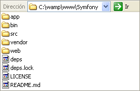

# El proyecto y los Bundles #

En el [capítulo anterior](#introduccion-a-symfony-2) hemos descargado el framework Symfony y lo hemos descomprimido en la carpeta correspondiente a nuestro localhost, lo que sería C:\\wamp\\www\\ ya que estamos usando wampserver. Con esto hecho, ya hemos realizado nuestra instalación y pudimos ingresar a la página de bienvenida por defecto en <http://localhost/Symfony/web/app_dev.php>. Para continuar entremos en más detalles sobre la estructura de nuestro proyecto.

## Estructura de un proyecto Symfony ##

Si vemos el contenido de nuestro proyecto en C:\\wamp\\www\\Symfony\\ vemos los siguientes archivos y carpetas

* __app\\:__ Aquí se encuentra la _configuración_ correspondiente a todo el proyecto. Si ya has trabajado con symfony 1.x es muy importante entender que en la versión 2, por lo general debe existir __una__ sola aplicación por proyecto. El concepto de tener varias aplicaciones en esta nueva versión es conocido por tener varios Bundles, concepto que veremos más adelante en este capítulo.
* __bin\\:__ Dentro de esta carpeta tenemos el script vendors.sh que se utiliza para actualizar el framework vía consola.
src\\: Esta es la carpeta donde irá todo _nuestro código_ y es aquí donde residen los Bundles que básicamente son carpetas que representan nuestras aplicaciones. Veremos más de esto en la sección “¿Qué son los Bundles?”.
* __vendor\\:__ En esta carpeta se encuentran los archivos del _framework_ Symfony y de las demás _librerías de terceros_ como por ejemplo Doctrine, Twig, etc.
* __web\\:__ En la carpeta web es donde deberán estar los _archivos públicos del proyecto_ como los javascripts, css, etc. También se encuentran dentro de esta carpeta los _controladores frontales_ que se explican a continuación. Solo estos archivos deberán poder ser accedidos desde un navegador.

## Controladores Frontales ##

Es sumamente importante entender que los archivos que no se encuentren dentro de la carpeta web\\ no pueden y no deben ser accedidos por el navegador ya que forman parte de la programación interna del proyecto. Por lo tanto nuestras páginas y programas que son guardados dentro de la carpeta src\\ __no son directamente accedidos__ por el navegador sino a través de los controladores frontales.

Dentro de la carpeta web\\ vemos que existen dos archivos: “app.php” y “app_dev.php”. Estos son los archivos llamados controladores frontales y son a través de ellos que accederemos a nuestras páginas. La diferencia entre ambos es que Symfony maneja __entornos__, lo que significa que a través de ambos podemos acceder a las mismas páginas pero con diferentes configuraciones. Existen dos entornos configurados por defecto en un proyecto Symfony: desarrollo y producción. Hablaremos un poco más sobre entornos en la siguiente sección, mientras tanto sigamos entendiendo los controladores frontales.

Cualquier petición (request) que llegue a la aplicación para solicitar una página específica debe ser sobre nuestros controladores y no directamente a ellas. Esto es debido a que los controladores frontales levantan todas la utilidades necesarias del framerwork y luego invocan a la página solicitada.

Este es el motivo por el cual en el [capítulo anterior](#introduccion-a-symfony-2), pudimos acceder directamente a la dirección <http://localhost/Symfony/web/config.php> para comprobar nuestro servidor ya que es una página dentro de la carpeta web\\ pero, a la hora de ingresar ya a nuestra aplicación ingresamos usando el controlador frontal <http://localhost/Symfony/web/app_dev.php>.

## Entornos ##

En la sección anterior habíamos hablado un poco sobre los entornos. Pudimos ver que Symfony ya trae configurado dos entornos muy necesarios, __desarrollo y producción__. La diferencia entre ambos es con relación a la configuración. El entorno de __desarrollo__ está configurado para brindar ayuda al desarrollador, mientras que el entorno de __producción__ está optimizado para los usuarios finales del sitio.

Dicho de otra manera, mientras estemos trabajando con la construcción y programación de nuestro sitio Web accedemos a las páginas a través del entorno de desarrollo pero, una vez que lo hayamos subimos a un hosting y lo disponibilizamos a los usuarios finales las páginas deberán ser accedidas por medio del entorno de producción.

Para probarlo puedes hacer lo siguiente: Si ingresas a esta dirección <http://localhost/Symfony/web/app_dev.php> ves la página de bienvenida desde el entorno de desarrollo. Si quieres acceder a la misma desde el entorno de producción usas el controlador frontal correspondiente al mismo <http://localhost/Symfony/web/app.php>.

### Nota ###
> En caso de que al ingresar a la URL correspondiente al entorno de producción salga un error puedes probar borrando el contenido de la carpeta app\\cache\\.

## La cache de Symfony ##

Una de las configuraciones más interesantes de ambos entornos sería con relación a que Symfony maneja una cache donde realiza una especie de pre-compilación de las páginas. Como Symfony maneja tantos archivos y formatos como YAML, XML, Twig y PHP, al momento de ingresar por primera vez al sitio, toma todos los archivos y los convierte a PHP guardándolos dentro de la carpeta app\\cache\\.

Esto se hace para que no se pierda tiempo generando todo por cada página solicitada. Una vez realizado esto, simplemente las páginas son accedidas por medio de la cache, razón por la cual la primera vez que se ingresa al sitio tardará un poco más que las siguientes y cada vez que se hayan realizado cambios sobre estos archivos debemos borrar la cache para que Symfony la vuelva a generar.

Para el entorno de __desarrollo__ la cache se genera por cada petición de las páginas sin necesidad de que el programador tenga que borrarla a mano mientras que en el entorno de __producción__ lo debemos hacer nosotros mismos ya que la idea es mantenerla para ganar rapidez.

Para borrar la cache podemos simplemente eliminar el contenido de la carpeta app\\cache\\.

## Symfony profiler ##

Accediendo al entorno de desarrollo también podremos ver una barra en la parte inferior de la página llamada “Symfony profiler” que nos da información actualizada por cada request sobre varias cosas útiles para desarrollador como parámetros del request, sentencias SQL ejecutadas, tiempos transcurridos, datos de sesión, etc. Por supuesto esta barra se encuentra deshabilitada en el entorno de producción.

## Mensajes de error ##

Como un punto de seguridad también es importante saber que en el entorno de desarrollo, Symfony nos mostrará mucha más información de los errores producidos. Por ejemplo si intentamos ingresar a una página no existente en el entorno de desarrollo se nos mostrará un StackTrace completo mientras que en el entorno de producción simplemente dira: Error 404 – Página no encontrada.

## ¿Qué son los Bundles? ##

Ya hemos venido nombrando esta palabra dentro de este capítulo así que hablemos un poco más detalladamente. Un Bundle es básicamente una carpeta que contiene los archivos necesarios para un grupo de funcionalidades específicas, como por ejemplo un blog, un carrito de compras o hasta el mismo frontend y backend de nuestra aplicación. La idea es que yo debería poder llevar este Bundle a otro proyecto y reutilizarlo si quiero.

### Nota ###

> Para los que hayan trabajado con la versión 1.x de Symfony, un Bundle es una mezcla entre las aplicaciones y los plugins ya que este es el motivo por el cual decíamos que a partir de la versión 2 un proyecto debería tener una sola aplicación y no varias como anteriormente era normal, debido a que para este concepto existen los Bundles. Con relación a los Plugins, estos deberán ser reescritos como Bundles.

Una aplicación en Symfony2 podrá contener todos los Bundles que queramos y necesitemos, simplemente debemos crearlos y registrarlos. Los Bundles que nosotros creemos deberán ir dentro de la carpeta src\\ del proyecto mientras que los Bundles de terceros deberán ir dentro de la carpeta vendor\\.

Un Bundle tiene una estructura de carpetas y archivos definidos y un nombre identificador dentro de nuestro proyecto que lo utilizaremos varias veces para hacer referencia al mismo. Como ya vimos, nuestros bundles se guardarán dentro de la carpeta src\\, y dentro de esta carpeta se almacenan los bundles que podría llamarse por ejemplo FrontendBundle, BlogBundle, CarritoBundle, etc. Lo ideal es no guardar directamente los bundles dentro src\\ sino dentro de una carpeta que represente a la empresa o a nosotros a la cual llamamos paquete, esto a fin de que si alguien más crea un BlogBundle no se confunda con el nuestro.

Por ejemplo, podríamos crear un bundle para nuestro manual de Maestro del Web creando un paquete MDW\\ y dentro de este un bundle con nombre DemoBundle (sufijo Bundle obligatorio). Aquí crearemos todo nuestro código de ejemplo.

La versión estándar de Symfony2 viene ya con un Bundle de ejemplo llamado AcmeBundle y es el que se ejecuta al ingresar a <http://localhost/Symfony/web/app_dev.php> dándonos la bienvenida. Nosotros crearemos nuestro propio Bundle pero para esto haremos una pequeña modificación en el archivo app\\config\\routing_dev.yml en donde buscaremos las siguientes líneas:

    [yaml]
    _welcome:
      pattern:  /
      defaults: { _controller: AcmeDemoBundle:Welcome:index }

y las reemplazaremos por

    [yaml]
    _welcome:
      pattern:  /bienvenida
      defaults: { _controller: AcmeDemoBundle:Welcome:index }

Con esto lo que hicimos fue liberar la dirección <http://localhost/Symfony/web/app_dev.php> que corresponde a la bienvenida. Ahora para ingresar a esta página debemos escribir <http://localhost/Symfony/web/app_dev.php/bienvenida> en lugar de la anterior. Esto solo lo hicimos para que podamos usar la dirección URL anterior para nuestro Bundle. Ahora ingresando a la primera dirección debería dar un error 404 ya que no existe página asignada a esa ruta.

## El comando console ##

Como decíamos, un bundle es simplemente una carpeta que contiene carpetas y archivos. Para no crearlos a mano usaremos una utilidad de Symfony llamada “console”.

Abriremos un cmd y entraremos al directorio de nuestro proyecto con el siguiente comando:

    [cli]
    C:\\>cd wamp\\www\\Symfony

Ahora usaremos la utilidad mencionada para pedirle a Symfony que nos diga que versión del framework se está usando. Esto lo hacemos de la siguiente manera:

    [cli]
    C:\\wamp\\www\\Symfony>php app\\console --version

Al ejecutar esto se nos mostrará un texto similar a: Symfony version 2.0.0 – app/dev/debug

### Nota ###

> En caso de que no se encuentre el comando “php”, deberá agregar el directorio C:\\wamp\\bin\\php\\php5.3.5\\ al PATH del Windows, carpeta que contiene el interprete de PHP (php.exe).
> Es posible que necesites cerrar y volver a entrar al CMD si haces este cambio.

El archivo app\\console no es nada más que un script PHP que ejecuta varias tareas (tasks) dependiendo de los parámetros que le pasemos como por ejemplo es el parámetro “–version”, que nos devuelve la versión de nuestro framework.

Existen muchas tareas que Symfony puede hacer por nosotros. Para verlas todas simplemente puedes hacerlo ejecutando el script sin pasarle parámetros:

    [cli]
    C:\\wamp\\www\\Symfony>php app\\console

## Creando nuestro propio Bundle ##

Para crear nuestro MDW\\DemoBundle haremos uso del comando “console” de Symfony2 pasándole el parámetro “generate:bundle”. Ejecutemos en el cmd lo siguiente:

    [cli]
    C:\\wamp\\www\\Symfony>php app\\console generate:bundle

Con este comando se ejecutará un generador que nos hará varias preguntas para crear nuestro Bundle como se muestra a continuación:

1. Lo primero que nos pide será el namespace o carpeta contenedora del Bundle para lo que le diremos que deberá estar dentro de una carpeta MDW y el nombre de la carpeta de nuestro bundle será DemoBundle. Esto lo hacemos escribiendo: MDW\\DemoBundle.
2. A continuación nos pedirá un nombre identificador del Bundle para el proyecto y nos propone entre corchetes la concatenación MDWDemoBundle. Para aceptar la propuesta daremos enter.
3. A continuación nos preguntará donde queremos que se guarde el nuevo bundle creado. Aceptaremos la propuesta.
4. Nos pide el formato de archivo que usará para las configuraciones del Bundle. Nos propone [annotations] pero le diremos que queremos que sea “yml”.
5. Luego nos pregunta si queremos que nos genere una estructura completa para el bundle y le vamos a decir que “no” ya que necesitamos solo la base.
6. Confirmamos si todo esta bien.
7. Nos pregunta si queremos registrar nuestro Bundle en el archivo app\\AppKernel.php a lo que le diremos que si.
8. Nos pregunta si queremos actualizar el archivo app\\config\\routing.yml y le decimos que si.

Con esto ya tenemos nuestro Bundle y lo deberíamos ver de la siguiente manera:

Ahora ya tenemos dentro de la carpeta src\\ una carpeta correspondiente a la empresa llamada MDW y dentro de esta nuestro DemoBundle con sus carpetas y archivos necesarios. Tendremos que recordar que el identificador del bundle será “MDWDemoBundle”.

En el archivo AppKernel.php si lo abrimos, veremos una línea que apunta al archivo MDW\\DemoBundle\\MDWDemoBundle.php y lo que hace es habilitarlo para el proyecto. Todo Bundle nuevo o de terceros que incluyamos al proyecto deberán ser registrados aquí agregando esta línea.

    [php]
    $bundles = array(
         ...
         new MDW\\ManualBundle\\MDWDemoBundle(),
    );

### Nota ###

> Para los que trabajaron con Symfony 1.x, esto sería similar a habilitar plugins en el archivo ProjectConfiguration.class.php.

Por último vemos que también se agregaron las siguientes líneas al archivo app\\config\\routing.yml

    [yaml]
    MDWDemoBundle:
        resource: "@MDWDemoBundle/Resources/config/routing.yml"
        prefix:   /

Veremos más sobre el archivo routing.yml en el siguiente capítulo, pero por el momento entraremos a la página de ejemplo que se crea automáticamente al crear un Bundle con la siguiente dirección: <http://localhost/Symfony/web/app_dev.php/hello/minombre> donde “minombre” lo podemos reemplazar por nuestro nombre como un parámetro GET. Con esto deberíamos poder ver una página en blanco con el texto Hello {minombre}.

## Resumen Final ##

En este capítulo ya hemos entrado a más bajo nivel entendiendo la estructura de un proyecto Symfony. Hemos hablado sobre los controladores frontales y los entornos de desarrollo y producción.

Entendimos uno de los conceptos más importantes de Symfony2 conocido como los Bundles y hemos usado las tareas de Symfony que se ejecutan por medio del script “console”. Por último ya hemos creado un Bundle propio para nuestro manual en donde iremos trabajando con los siguientes capítulos.