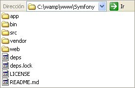
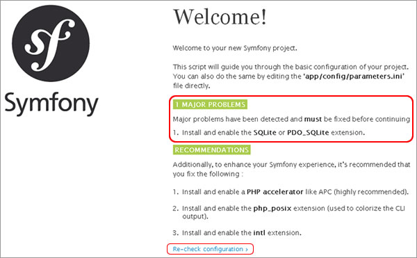
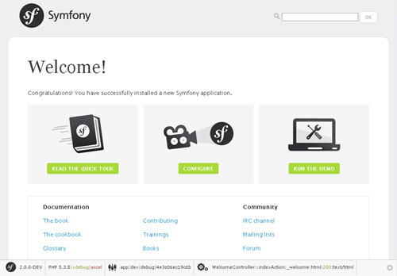

# Introducción a Symfony # {#introduccion-a-symfony-2}

Symfony es un framework PHP basado en la arquitectura MVC (Model-View-Controller). Fue escrito desde un origen para ser utilizado sobre la versión 5 de PHP ya que hace ampliamente uso de la orientación a objetos que caracteriza a esta versión y desde la versión 2 de Symfony se necesita mínimamente  PHP 5.3.

Fue creado por una gran comunidad liderada por [Fabien Potencier](http://fabien.potencier.org/about), quién a la fecha, sigue al frente de este proyecto con una visión muy fuertemente orientada hacia las mejores prácticas que hoy en día forman parte del estándar de desarrollo de software.

Por más que Symfony puede ser utilizado para otros tipos de desarrollos no orientados a la Web, fue diseñado para optimizar el desarrollo de aplicaciones Web, proporcionando herramientas para agilizar aplicaciones complejas y guiando al desarrollador a acostumbrarse al orden y buenas prácticas dentro del proyecto.

El concepto de Symfony es _no reinventar la rueda_, por lo que reutiliza conceptos y desarrollos exitosos de terceros y los integra como librerías para ser utilizados por nosotros. Entre ellos encontramos que integra plenamente uno de los frameworks ORM más importantes dentro de los existentes para PHP llamado [Doctrine](http://www.doctrine-project.org/), el cual es el encargado de la comunicación con la base de datos, permitiendo un control casi total de los datos sin importar si estamos hablando de MySQL, PostgreSQL, SQL server, Oracle, entre otros motores ya que la mayoría de las setencias SQL no son generadas por el programador sino por el mismo Doctrine.

Otro ejemplo de esto es la inclusión del framework [Twig](http://www.twig-project.org/), un poderoso motor de plantillas que nos permite separar el código PHP del HTML permitiendo una amplia gama de posibilidades y por sobre todo un extraordinario orden para nuestro proyecto.

Gracias al lenguaje YAML, competidor del XML, tenemos una gran cantidad de configuración totalmente separada del código permitiendo claridad como lo iremos viendo en los demás capítulos. Cabe mencionar que en caso de no querer trabajar con YAML también podemos usar estos archivos de configuración con XML o PHP.

Contamos con las instrucciones de consola denominadas tasks (tareas), que nos permiten ejecutar comandos en la terminal diciéndole a Symfony que nos genere lo necesario para lo que le estamos pidiendo, como por ejemplo podría ser la generación completa de los programas necesarios para crear ABMs, tarea que suele ser muy tediosa para los programadores ya que siempre implica mucho código para realizar la misma idea para diferentes tablas.

Otra de las funcionalidades más interesantes, es que contiene un subframework para trabajar con formularios. Con esto, creamos una clase orientada a objetos que representa al formulario HTML y una vez hecho esto simplemente lo mostramos y ejecutamos.

Es decir que no diseñamos el formulario con HTML sino que lo programamos utilizado herramientas del framework. Esto nos permite tener en un lugar ordenados todos los formularios de nuestra aplicación incluyendo sus validaciones realizadas en el lado del servidor, ya que symfony implementa objetos validadores muy sencillos y potentes para asegurar la seguridad de los datos introducidos por los usuarios.

Contamos con un amplio soporte para la seguridad del sitio, que nos permite despreocuparnos bastante de los ataques más comunes hoy en día existentes como ser SQL Injection, XSS o CSRF. Todos estos ataques ya tienen forma de prevenir, por lo tanto, dejémosle a Symfony preocuparse por ellos y enfoquemos nuestra atención en los ataques que pueden ser realizados por un mal uso de nuestra lógica de negocio.

Logramos una aplicación (sitio Web) donde __todo__ tiene su lugar y donde el mantenimiento y la corrección de errores es una tarea mucho más sencilla.

Contamos con un gran número de librerías, herramientas y helpers que nos ayudan a desarrollar una aplicación mucho más rápido que haciéndolo de la manera tradicional, ya que muchos de los problemas a los que nos enfrentamos ya fueron pensados y solucionados por otras personas por lo tanto ¡¡¡dediquémonos a los nuevos problemas que puedan surgir!!!

Sobre todo esto hablaremos en los siguientes capítulos pero antes entendamos un poco más sobre el concepto de la arquitectura MVC y otros muy interesantes.

### Nota ###

> Si ya has trabajado con versiones anteriores de Symfony o ya entiendes el concepto de Arquitectura MVC, Frameworks ORM y Motores de Plantillas puedes ir directamente a la sección “__Documentación oficial__” de este capítulo para conocer más sobre la documentación de Symfony y comenzar a descargar el Framework.

## Entendiendo la Arquitectura MVC ##

El término MVC proviene de tres palabras que hoy en día se utilizan mucho dentro del ambiente de desarrollo de software: Model – View – Controller, lo que sería en castellano Modelado, Vista y Controlador. Esta arquitectura permite dividir nuestras aplicaciones en tres grandes capas:

* __Vista:__ Todo lo que se refiera a la visualización de la información, el diseño, colores, estilos y la estructura visual en sí de nuestras páginas.
* __Modelado:__ Es el responsable de la conexión a la base de datos y la manipulación de los datos mismos. Esta capa esta pensada para trabajar con los datos como así también obtenerlos, pero no mostrarlos, ya que la capa de presentación de datos es la __vista__.
* __Controlador:__ Su responsabilidad es procesar y mostrar los datos obtenidos por el Modelado. Es decir, este último trabaja de intermediario entre los otros dos, encargándose también de la lógica de negocio.

Veamos una imagen para tratar de entenderlo mejor:

El cliente envía una señal llamada REQUEST o Petición, ésta es interceptada por el __Controlador__ quien realiza las validaciones necesarias, procesamiento de dichos datos y lógica de negocio asociadas a esa petición del cliente. El __Controlador__ envía datos al __Modelado__, por ejemplo para ser guardados en una base de datos y/o los obtiene dependiendo de la solicitud del usuario para finalmente envíarlos a la __Vista__ a fin de ser mostrador nuevamente al cliente a través de un RESPONSE o respuesta.

Symfony es un framework totalmente basado sobre la arquitectura MVC por lo que veremos poco a poco como se implementan estos conceptos.

## ¿Qué es un framework ORM? ##

La siglas ORM provienen de Object-Relational mapping o Mapeo entre Objetos y Relaciones. Este framework es el encargado de tratar con nuestra base de datos desde la conexión, generación de SQL, manipulación de datos, transacciones y desconexión.

Cuando hablamos de motores de base de datos se dice que cada tabla es una relación, de ahí el nombre de base de datos relacionales, lo que implica que las tablas se encuentran relacionadas entre sí.

Cuando hablamos de una aplicación orientada a objetos decimos que tratamos con objetos y no con tablas. Cuando agregamos un registro a la tabla de personas por ejemplo, en realidad decimos que agregamos un nuevo objeto Persona. Cuando decimos que un país esta relacionado a varias personas, estamos diciendo que un objeto País contiene un colección de objetos Persona.

Para esto, lo que hacemos es crear clases que mapean cada relación de la base de datos y en lugar de hablar directamente con la base de datos, nosotros los programadores, hablamos con los objetos y Doctrine se encargará de traducir lo necesario para hablar con la base de datos.

Con esto logramos una abstracción casi del 100% con relación al motor de base de datos, sin importar cual sea, ya que hoy en día la mayoría de ellos se encuentran soportados por Doctrine.

Symfony toma el framework Doctrine y lo incorpora dentro de sí mismo, proporcionándonos todo el soporte necesario para utilizarlo sin preocuparnos por la configuración del mismo. Hablaremos más detenidamente sobre Doctrine y su forma de uso a partir del capítulo 8.

## Utilizando un Motor de Plantillas ##

Nos hemos acostumbrado a escribir código PHP en el mismo archivo donde se encuentra la estructura HTML de la página. La idea de un motor de plantillas es justamente separar esto en dos capas. La primera sería el programa con la lógica de negocio para resolver el problema especifico de esa página, mientras que la otra sería una página que no contenga el mencionado código sino solo lo necesario para mostrar los datos a los usuarios.

Una vez que hemos solucionado la lógica necesaria, ya sea ejecutando condiciones, bucles, consultas a bases de datos o archivos, etc. tendríamos que guardar los datos que finalmente queremos mostrar en variables y dejar que el motor de plantillas se encargue de obtener la plantilla con el HTML necesario y mostrar el contenido de las variables en sus respectivos lugares.

Esto nos permite, en un grupo de desarrollo dejar la responsabilidad de la capa de diseño al diseñador y la programación de la lógica al programador.

Existen varios motores de plantillas dentro del mundo de PHP hoy en día. Ya hace un buen tiempo, Fabien Potencier, líder del proyecto Symfony, realizó pruebas con relación a los motores de plantillas existentes en el mercado y el resultado lo publicó en su blog bajo el título [Templating Engines in PHP](http://fabien.potencier.org/article/34/templating-engines-in-php). Se puede ver ahí que tras muchas pruebas y análisis el framework de plantillas [Twig](http://www.twig-project.org/) es adoptado dentro de la nueva versión de Symfony. Hablaremos más sobre la forma de uso de Twig en el capítulo 7.

## Documentación oficial ##

Symfony cuenta hoy en día con dos ramas estables. La versión 1.4 es la última de la primera generación y el 28 de julio de 2011 se ha lanzado oficialmente la versión 2 creando una nueva rama. Hay bastante diferencia entre la rama 1.4 y la 2, por lo que este manual está basado en la nueva versión como una introducción a la misma.

Es bueno tener en cuenta que gran parte de la potencia de Symfony, siempre ha sido la excelente documentación publicada, ya que esto forma parte del éxito del aprendizaje.

En el [sitio oficial](http://www.symfony.com/) encontramos 4 excelentes libros sobre Symfony que van mejorando día a día por el equipo mismo de desarrolladores y documentadores.

* [Quick Tour:](http://symfony.com/doc/2.0/quick_tour/index.html) Guía de introducción a la versión 2 de Symfony.
* [The Book:](http://symfony.com/doc/2.0/book/index.html) Libro oficial completo con todas las funcionalidades.
* [The Cookbook:](http://symfony.com/doc/current/cookbook/index.html) Una recopilación de varios artículos específicos sobre ciertos puntos interesantes. Muy útil después de haber leído los dos primeros libros.
* [Glossary:](http://symfony.com/doc/current/glossary.html) Una glosario de palabras que podrían ser sumamente útil entenderlas bien durante la lectura de los demás.

Si quieres dar un vistazo a los libros, los recomiendo en el orden en que los explico arriba. También existe una amplia documentación sobre [Doctrine](http://www.doctrine-project.org/) y [Twig](http://www.twig-project.org/) en sus sitios oficiales. Al igual que Symfony ambos son dependientes de la compañía [SensioLabs](http://sensiolabs.com/.

También podemos acceder al blog de noticias más concurrido por la comunidad de Symfony en español <www.symfony.es> donde no solo estaremos al tanto de las últimas noticias del framework sino que también fue publicado un libro por [@javiereguiluz](http://twitter.com/javiereguiluz), creador del blog llamado “Desarrollo Web ágil con Symfony”.

## Descargando la versión 2 de Symfony ##

Podremos [descargar](http://symfony.com/download) diferentes versiones de Symfony desde el [sitio oficial](www.symfony.com). La primera es la versión estándar completa comprimida en formato .zip y .tgz y la otra es una versión que no contiene los vendors también en ambos formatos comprimidos. Más adelante entenderemos que son los vendors por lo que descargaremos directamente la versión estándar completa en cualquiera de los dos formatos de compresión.

### Nota ###

> Para este manual se usará la última versión disponible de wampserver utilizando Windows como Sistema Operativo, habiéndolo instalado en C:\wamp\. La última versión de Symfony se encuentra en 2.0.9.

Instalando el framework

Una vez que hayamos descargado el archivo, lo descomprimiremos dentro de nuestro localhost en la carpeta C:\wamp\www\ bajo el nombre de Symfony con lo que tendremos los siguientes archivos y directorios.

Para saber si nuestro servidor cuenta con todo lo necesario para soportar el framework podemos acceder a la siguiente dirección <http://localhost/Symfony/web/config.php> con la cual veremos la siguiente pantalla.

Esta pantalla nos mostrará los requerimientos mínimos y las recomendaciones para usar Symfony en nuestro server.

Los requerimientos mínimos son obligatorios solucionarlos por nuestra parte y son mostrados en la sección marcada en rojo en la imagen anterior. En este caso nos dice que tenemos que tener instalada y habilitada la extensión para SQLite ya que Symfony hace uso de esta extensión por más que nosotros usemos otro motor de base de datos como MySQL.

Una vez solucionados todos los requerimientos mínimos podemos presionar sobre “Re-check configuration” hasta que no aparezcan más. Nos quedarían las recomendaciones pero ya podemos usar el framework.

Con esto ya podríamos ingresar a nuestro sitio: <http://localhost/Symfony/web/app_dev.php> y ver la pantalla de bienvenida diciéndonos que la instalación está correcta y felicitándonos por el arduo trabajo de instalación :-)

## Resumen Final ##

Para cerrar este capítulo sobre la introducción a Symfony hagamos un resumen sobre los temas tratados.

__Hablamos un poco sobre Symfony como framework__ de desarrollo de aplicaciones Web, viendo algunas de las muchas ventajas y aclaramos que la versión utilizada para este manual sera la versión 2.0.x.

Vimos una __introducción sobre ciertos conceptos sumamente importantes__ para entender la forma de trabajo que tendremos en los siguientes capítulos, hablando sobre la arquitectura Model-View-Controller, la idea de usar un framework ORM para comunicación con la base de datos y las bondades de trabajar con un motor de plantillas como Twig.

Hemos hablado también que __Symfony publica mucha información como documentación oficial__ que siempre se mantiene actualizada y por último, hemos descargado el framework y lo hemos puesto dentro de nuestro localhost para ser accedido con el navegador. Con esto ya hemos realizado la instalación correspondiente.

Con esta pequeña introducción daremos un salto directo al siguiente capítulo donde hablaremos de la estructura de directorios de Symfony2 y sobre los Bundles.
